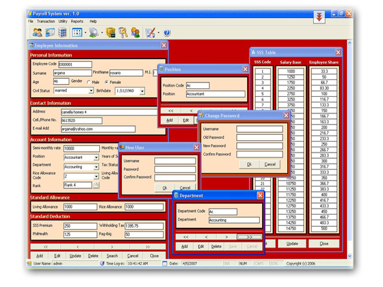



## Simple Payroll System

### Description

This is only a Simple Payroll system (My first Learning in ADO) i made it for my client, 3 years ago....if you like this code pls...give feedbacks and vote for it..
 
### More Info
 

             |
---                |---
**Submitted On**   |2007-03-16 14:02:02
**By**             |[JaDe Software](https://github.com/Planet-Source-Code/PSCIndex/blob/master/ByAuthor/jade-software.md)
**Level**          |Beginner
**User Rating**    |4.5 (54 globes from 12 users)
**Compatibility**  |VB 6\.0
**Category**       |[Databases/ Data Access/ DAO/ ADO](https://github.com/Planet-Source-Code/PSCIndex/blob/master/ByCategory/databases-data-access-dao-ado__1-6.md)
**World**          |[Visual Basic](https://github.com/Planet-Source-Code/PSCIndex/blob/master/ByWorld/visual-basic.md)
**Archive File**   |[Simple\_Pay205856442007\.zip](https://github.com/Planet-Source-Code/jade-software-simple-payroll-system__1-68295/archive/master.zip)

